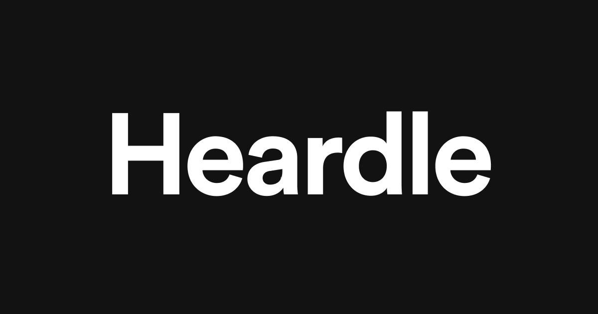

# Heardle App Inspired React Game



## Overview

This project is an inspired version of the popular "Heardle" app, a music puzzle game where players attempt to guess a song based on a snippet of its music. While not an exact replica, this clone offers a unique twist. Unlike the original game, this version does not refresh daily, providing players with a new song each time they reload the website. Additionally, the stats displayed are predefined and do not update based on gameplay.

## Features

- **Dynamic Song Selection**: Experience a new challenge with every refresh, as the game randomly selects a song for you to guess.
- **Static Stats Display**: Track predefined stats for the sake of aesthetics, as the stats do not update based on your gameplay.
- **Real-time Feedback**: Get instant feedback as you make guesses, and see how well you can identify songs.
- **Responsive Design**: The app is designed to be responsive and work seamlessly on various devices and screen sizes.

## How to Play

1. To start the game, you press the Play button. It’ll give you one second of the song.
2. Using the search section, type the song you think it is. If you don’t know, you can press Skip to unlock more of the song. Or, if you take a stab but guess incorrectly, you’ll still progress and unlock more of the song.
3. In the second attempt you hear two seconds, then four seconds, seven seconds, then 11 seconds and finally 16 seconds to guess the song.
4. If on the sixth guess you still don’t know the answer, then you’ve technically lost the game.

## Demo

[](https://alexflorides.github.io/heardle-clone/)

## Logic Behind the Game
### Song Selection with Deezer API
The game leverages the [Deezer API](https://rapidapi.com/deezerdevs/api/deezer-1) to fetch a random song for each round. A curated selection of playlists has been chosen to ensure a diverse and enjoyable song library. This integration allows for a dynamic and ever-changing gameplay experience.

### Search Functionality with Debounce
For the search functionality, a debounce function is employed to optimize performance and enhance the user experience. The debounce function ensures that the search fetch is triggered only after the user has stopped typing, preventing excessive API calls and reducing unnecessary load on the server. This results in a smoother and more responsive search experience for the player.

### Highlighting Search Results with mark.js
To enhance the visibility of search results, the game utilizes the [mark.js](https://markjs.io/) npm package. This library allows for the dynamic highlighting of search terms within the song title, making it easier for players to identify and focus on relevant information. The integration of mark.js contributes to a more user-friendly and visually appealing game interface.

## How to Run

1. Clone the repository to your local machine:

```bash
git clone https://github.com/AlexFlorides/heardle-clone.git
```

2. Navigate to the project directory:

```bash
cd heardle-clone
```

3. Install dependencies:

```bash
npm install
```

4. Start the development server:

```bash
npm start
```

5. Open your browser and visit [http://localhost:3000](http://localhost:3000) to see the Heardle App Clone in action.

## Technologies Used

- React.js
- Deezer API
- mark.js

## Contributing

If you'd like to contribute to the project, please follow these steps:

1. Fork the repository
2. Create a new branch for your feature or bug fix
3. Make your changes and submit a pull request

## Issues

If you encounter any issues with the app or have suggestions for improvement, please open an issue on the [Issues](https://github.com/AlexFlorides/heardle-clone/issues) page.